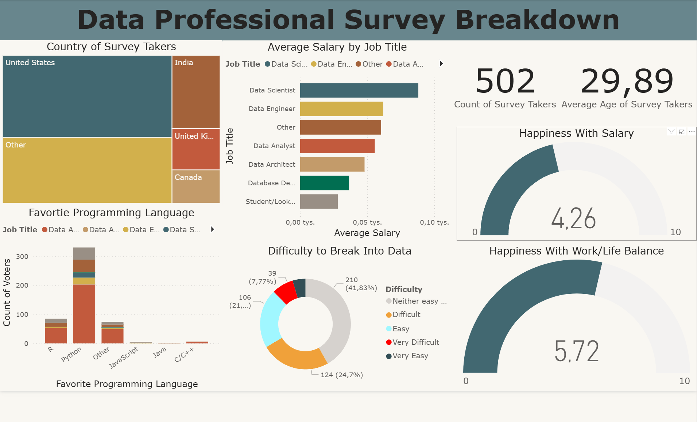

# Power BI – Final Dashboard Project

This repository contains my final Power BI project showcasing data cleaning, modeling, and interactive dashboard design.

## 📊 Project Overview

- Tool: **Power BI Desktop**
- Data source: **Excel file with cleaned and prepared data**
- Goal: Present key insights in a clear, interactive dashboard for a potential employer.

## 🧾 Files in this repository

- `/report/Dashboard_01.pbix` – main Power BI report file  
- `/data/Power BI - Final Project.xlsx` – dataset before cleaning
- `/data/professional_survey_cleaned.xlsx` - cleaned dataset used in the report
- `/screenshots/` – screenshots of the dashboard

## 🔍 Dashboard Highlights

- Interactive filters and slicers
- Drill-through / drill-down (where applicable)
- Clear KPI cards and summary visuals
- Proper data types and cleaned columns in Power Query

## 🚀 How to open the report

1. Download `report/Dashboard_01.pbix`
2. Open it in **Power BI Desktop**
3. Interact with the visuals, filters, and slicers

## 🧠 What this project demonstrates

- Data cleaning and transformation in **Power Query**
- Building a **data model** with relationships
- Designing a **user-friendly dashboard** with:
  - Slicers
  - Buttons
  - Different types of charts
 
## 🔧 Key Features
- Data cleaning in Power Query  
- Standardized dates and time formats  
- Removed duplicates and inconsistent values  
- Corrected data types  
- Created new helper columns  
- Overall data preparation for reporting purposes

##  🛠 Tech Stack / Tools Used
- **Power BI Desktop**
- **Power Query (M language)**
- **DAX (basics)**
- **Excel**
- **GitHub for version control**
- **Data visualization best practices**

    
## Dashboard preview

---

If you're reviewing this as part of a job application – thank you for taking the time to look at my work 🙌
